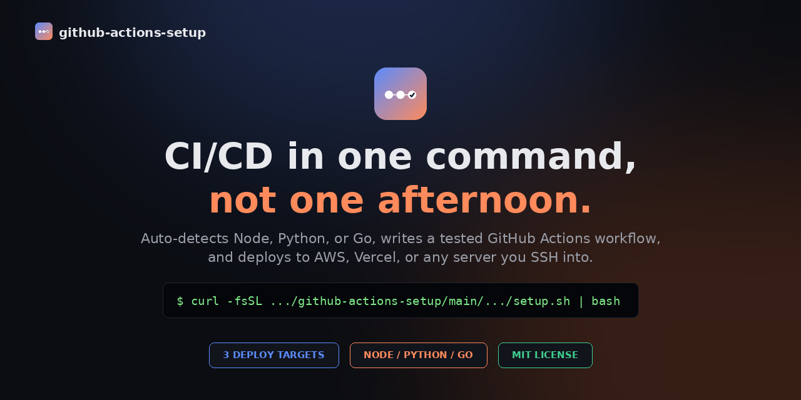

<div align="center">



# github-actions-setup

**A Claude skill that sets up automated CI/CD for any project in one command.**


Auto-detects your language, writes a tested GitHub Actions workflow, and wires up secrets, environments, and dependency updates — the way a careful senior engineer would, not a copy-pasted tutorial.

[Website](https://khemratechconsulting.github.io/github-actions-setup) · [Setup Guide](docs/setup-guide.md) · [Pricing](https://khemratechconsulting.github.io/github-actions-setup#pricing)

</div>

---

## What it does

Point it at a project and it will:

- **Detect the language** — Node, Python, or Go, from files already in the repo.
- **Ask where you deploy** — AWS (S3 + CloudFront via OIDC), Vercel (preview + production), or any server over SSH.
- **Generate a real workflow** — a `test` job gates a `deploy` job; nothing reaches production without passing tests first.
- **Set up Dependabot** — weekly dependency + GitHub Actions version updates, for free.
- **Tell you exactly what to do next** — the precise secret names to add, and which GitHub Environment to create.

```bash
bash <(curl -fsSL https://raw.githubusercontent.com/khemratechconsulting/github-actions-setup/main/skills/github-actions-setup/scripts/setup.sh)
```

(Or run it from a local clone: `bash skills/github-actions-setup/scripts/setup.sh`.)

This uses process substitution (`bash <(...)`) instead of the more common `curl ... | bash`. Piping straight into `bash` makes stdin the script's own source rather than your keyboard, so the script's interactive prompts can't read your answers — `bash <(...)` keeps your terminal attached to stdin, so prompts work normally. The script also has a `/dev/tty` fallback and non-interactive flags (`--deploy=`, `--lang=`, `--force`) if you'd rather use the plain pipe.

## Using it as a Claude skill

This repo is also a [Claude skill](https://docs.claude.com/en/docs/claude-code/skills) — add it to Claude Code or Cowork and it triggers automatically whenever you ask to "set up GitHub Actions," "add CI/CD," or similar. See `skills/github-actions-setup/SKILL.md`.

## What's included (free, MIT-licensed)

| Template | Covers |
|---|---|
| `ci-only.yml` | Tests only, matrix across two Node versions |
| `ci-cd-aws.yml` | Test → deploy to S3/CloudFront, OIDC auth |
| `ci-cd-vercel.yml` | Test → PR previews → production deploy |
| `ci-cd-generic-server.yml` | Test → SSH deploy + process restart |

Full write-up of the security and efficiency choices baked into these: [`skills/github-actions-setup/references/best-practices.md`](skills/github-actions-setup/references/best-practices.md).

## Pricing

The free tier above covers the three most common deploy targets and is a complete toolkit on its own.

| Tier | Price | Adds |
|---|---|---|
| Free | $0 | Everything listed above |
| **Supporter** | **$1.99/mo** | Priority email support, early access to new templates |

Get either from the [pricing section](https://khemratechconsulting.github.io/github-actions-setup#pricing) on the site.

<!--
Draft tiers — built and tested, held back until the project has a real
user base rather than launching four untested price points at once.
Uncomment this table (and the matching cards in docs/index.html /
docs/pro.html) to relaunch them.

| Tier | Price | Adds |
|---|---|---|
| Builder | $4.77/mo | Google Cloud Run (OIDC), Docker/GHCR multi-arch builds |
| Shipper | $7.77/mo | Staging → production promotion, Slack deploy notifications |
| Pro | $9.77/mo | Custom deploy target requests, 1:1 setup call |

<details>
<summary>Full feature breakdown</summary>

**Builder — $4.77/mo** (everything in Supporter, plus)
- Google Cloud Run deploy, authenticated via Workload Identity Federation
- Docker/GHCR multi-arch builds with layer caching and semver tagging

**Shipper — $7.77/mo** (everything in Builder, plus)
- Staging → production promotion workflow with a manual approval gate
- Slack notifications on deploy

**Pro — $9.77/mo** (everything in Shipper, plus)
- Custom deploy target requests
- A 30-minute 1:1 setup call

</details>
-->

## Contributing

Issues and PRs welcome — see [CONTRIBUTING.md](CONTRIBUTING.md). Found a security issue? See [SECURITY.md](SECURITY.md) instead of opening a public issue.

## License

MIT — see [LICENSE](LICENSE).
